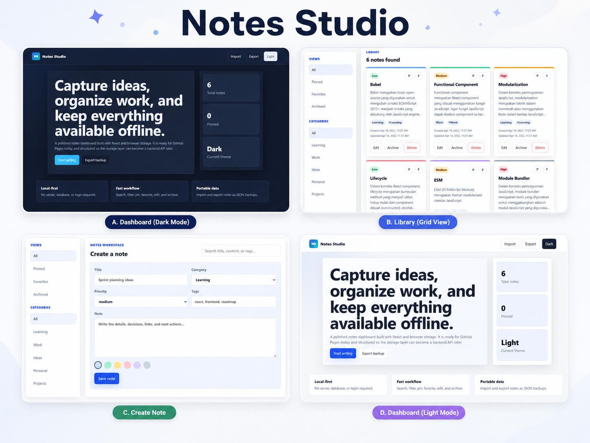

# M Rivaldo Destadhio Hamzah Portfolio Website

This is a modern, responsive, frontend-only portfolio website for **M Rivaldo Destadhio Hamzah**. It is designed to showcase web developer and fullstack developer projects, with a strong project section, Indonesian/English language switcher, and GitHub Pages ready deployment.

## Project Structure

```text
portfolio-website/
├── index.html
├── style.css
├── script.js
├── README.md
└── assets/
    ├── notes.png
    ├── StoryNest.png
    ├── sebelum.png
    ├── sesudah.png
    ├── akunhasil.png
    ├── moodc.png
    ├── history.png
    ├── dashboard.png
    ├── result.png
    └── interface.png
```

## How To Edit

### Edit Your Name

Open `index.html` and search for:

```html
M Rivaldo Destadhio Hamzah
```

You can change the name in the hero section, about section, contact section, and footer. Also update this `README.md` if needed.

### Edit Project Descriptions

Open `script.js`. The project text is inside the `translations` object for both languages:

```js
project.notes.description
project.story.description
project.himo.description
project.nerva.description
```

Edit the Indonesian text inside `id` and the English text inside `en`.

### Change Image Paths

Open `index.html` and search for image tags like:

```html

```

If your image extension is different, change the file path. Example:

```html

```

All image paths are relative so they work on GitHub Pages.

### Edit Social And Contact Links

Open `index.html` and search for the contact section. Replace the placeholder links:

```html
mailto:your-email@example.com
https://github.com/mrivaldodestadhiohamzah
#
```

Use your real email, LinkedIn URL, WhatsApp URL, and project source code URLs.

## How To Open Locally

Because this is a static website, you can open it directly:

1. Open the `portfolio-website` folder.
2. Double-click `index.html`.
3. The website will open in your browser.

You can also use a simple local server if you prefer:

```bash
npx serve .
```

## GitHub Push Instructions

Run these commands inside the `portfolio-website` folder:

```bash
git init
git add .
git commit -m "Initial portfolio website"
git remote add origin https://github.com/mrivaldodestadhiohamzah/portfolio-website.git
git branch -M main
git push -u origin main
```

Before running `git remote add origin`, create a new GitHub repository named:

```text
portfolio-website
```

## GitHub Pages Deployment

1. Open the repository on GitHub.
2. Go to **Settings**.
3. Open **Pages**.
4. Under **Build and deployment**, choose:
   - Source: **Deploy from a branch**
   - Branch: **main**
   - Folder: **/root**
5. Click **Save**.

Your website will be available at:

```text
https://mrivaldodestadhiohamzah.github.io/portfolio-website/
```

If you change the repository name, the GitHub Pages URL will follow this format:

```text
https://mrivaldodestadhiohamzah.github.io/REPOSITORY-NAME/
```

## Notes

- This website uses only HTML, CSS, and JavaScript.
- There is no backend, database, login system, or server-side code.
- The language switcher saves the selected language in `localStorage`.
- The website is ready to upload directly to GitHub Pages.
